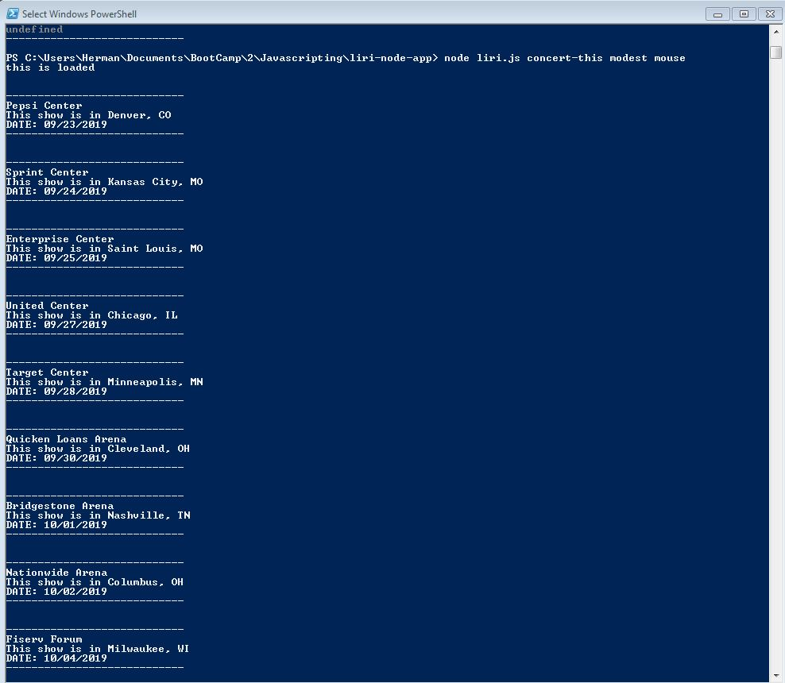
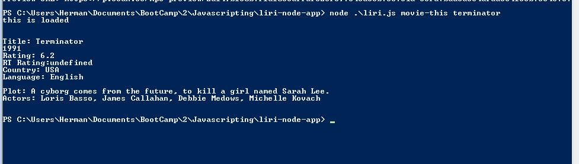
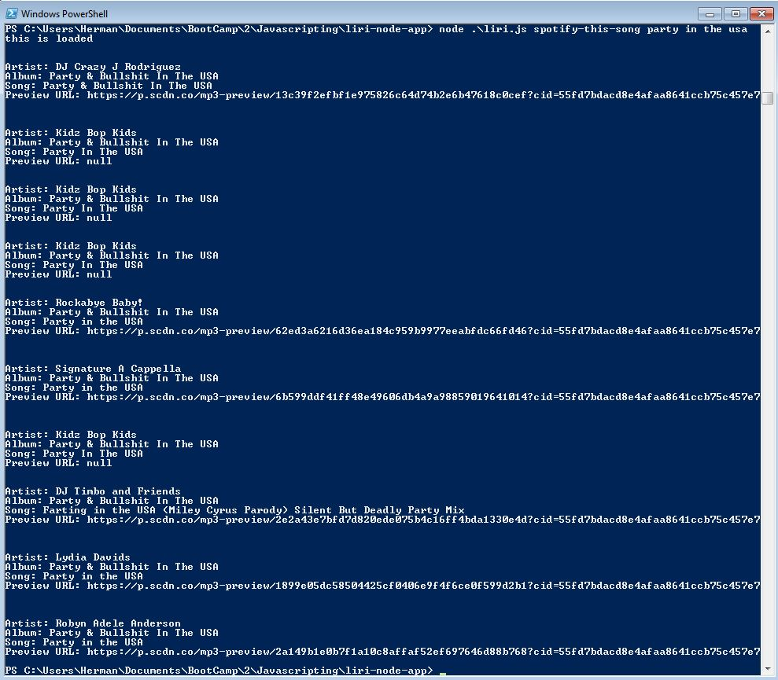
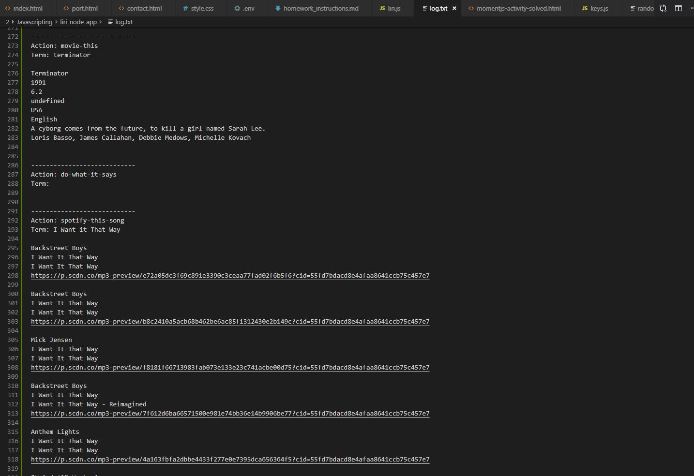

# liri-node-app
cli tool to search for concerts, movie information, and songs. Uses API's from Spotify, BandsinTown, and OMDB. Also appends information to a log file for future reference

## Concert search example

## Movie search

## Spotify

## Search appended to log

